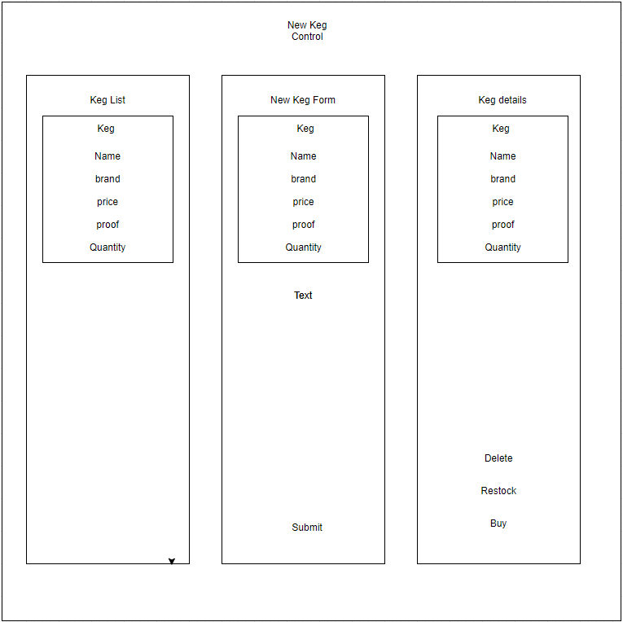

# _Tap-Room_

#### _Week 14 independent project for Epicodus_

#### By _**Joey Giunta**_

## Description
Uses react-create-app; allows the user to create and view kegs of drinks, and track pints for each

## Prerequisites

* Node js

## Setup

* _Install listed prerequisites following their own listed install instructions_
* _Download or clone this repository by copying the link from the green "code" dropdown menu and running "git clone {copied link}" in the command line_
* _open console in project-root/tap-room_
* _run "dotnet restore" followed by "dotnet build" project-root/tap-room_
* _run "dotnet tool install --global dotnet-ef" in project-root/tap-room_
* _run "dotnet run" project-root/tap-room_
* _use your web browser of choice to navigate to http://localhost:5000_

## Known Bugs

_There are currently no known bugs._

## Support and contact details

_If there are issues, please contact the following:_  
Joseph Giunta <giuntajc@comcast.net>

## Component Diagram

## Technologies Used
- HTML
- CSS
- Javascript
- React
- Git

### License

*Available under the MIT License.*

Copyright (c) 2021 **_Joseph C Giunta_**
